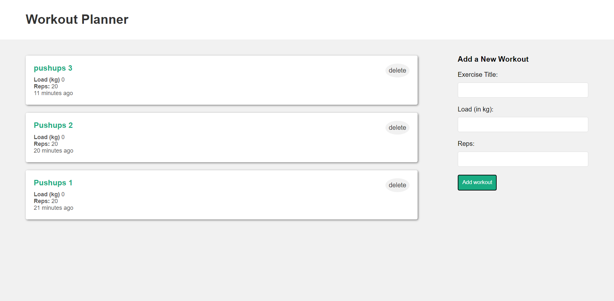

# Workout Planner

## Description
- This is a MERN stack application for keeping track of workouts
- The project follows the MVC design pattern
- The front end uses React hooks like useContext, useReducer and a custom hook
 - The backend uses Node.js, Express.js and connects to MongoDB Atlas (A cloud version of MongoDB) with Mongoose ODM
 - Currently it is not hosted and once I implement user authentication I will host it using AWS Amplify for the front end and EC2 for the server

 ## Current look
  - This is what it currently looks like without any user authentication

  

 ## Demo
  - To run it locally you will need to clone the repo
  - Enter npm install in the front end and server folders
  - Then start the frontend dev server and the backend server using:

        npm start
        nodemon
 - Then create an env file to hold the mongodb connection string

### Credits
 - Coded along with this [tutorial](https://www.youtube.com/@NetNinja)