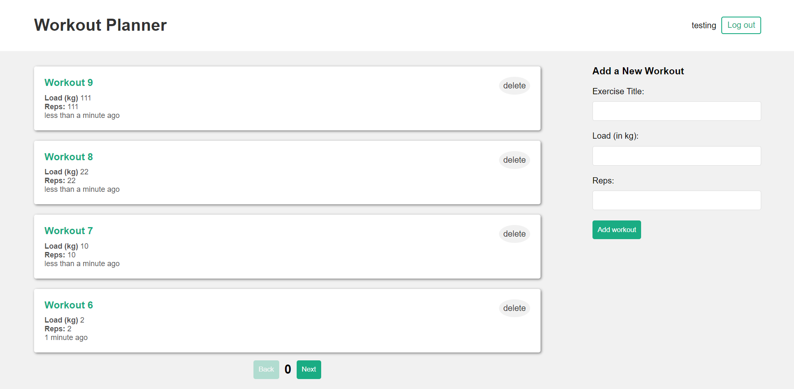

# Workout Planner (MERN stack) with JWT Auth

## Description
 - This is a MERN stack application for keeping track of workouts for individual user's
 - The project follows the MVC design pattern
 - The front end uses React hooks like useContext, useReducer and custom hooks. It also uses CSS and a little bit of HTML
 - The backend uses Node.js, Express.js and connects to MongoDB Atlas (A cloud version of MongoDB) with Mongoose
 - I implemented server side pagination at 4 workouts per page where the user fetches more data when the go to the next page
 - I used JWT for authorization to access data specific to the user (Currently the token is stored in local storage, I am aware of the security risk and will be saving it in a secure cookie)
 - User's only see their own workouts and that is enforced by the JWTs
 - Currently not hosted, I have plans to add some more features and then I will host it using AWS
  - Future plans: Store JWT in a secure location and make an edit feature

 ## Current look
  - This is what it currently looks like (currently not hosted)

  - ### Login page
  

  - ### Sign up page
  

  - ### Workouts for the current user
  

  - ### Page 2 of the workouts
  

 ## Demo
  - To run it locally you will need to clone the repo
  - Enter npm install in the front end and server folders
  - Then start the frontend dev server and the backend server using:

        npm start
        nodemon
 - Then create an env file to hold the mongodb connection string

### Credits
 - Coded along with this [tutorial](https://www.youtube.com/@NetNinja) to refresh my MERN stack knowledge